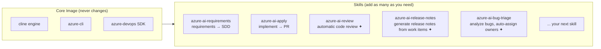

# cline-ado

> Open-source AI coding agent. Enterprise ADO workflow. Isolated Docker environment.

---

## The Problem

Your enterprise bans consumer IM tools. Your CI/CD lives entirely in Azure DevOps. Your developers want AI-assisted coding, but every cloud copilot either leaks proprietary code, requires a browser extension IT won't approve, or ignores your ticket system entirely.

cline-ado solves all three.

---

## What It Is

A single Docker image that bundles [Cline](https://github.com/cline/cline) — a production-grade, open-source AI coding agent — with the full Azure DevOps toolchain, then wires them together through a **skills system** that speaks native ADO.

The result: an AI agent that reads your work items, understands your codebase, writes the code, creates the PR, and closes the ticket. Without leaving your corporate perimeter.

---

## Architecture
https://lh3.googleusercontent.com/gg-dl/AOI_d_92NEhEq4Pvgea5bLsib3aqaJtKpscahsuHcdmNtS2vhfZIHZuheKcOll1TXizRGiCdPV49lKj0piQfx1LfNtJg8Tr4asi4RBjLF_RaDLshYHvD7S3Q0ycCweMvMOudvkYSlWCYqWcSh9yrGNqNkLupTkGLO5wkXKpNS_tAYtE3mb70sw=s1024-rj

```
  Developer
     │
     │  create ADO work item [AI]          create ADO work item [ai]
     │  activity: Requirements              activity: Development
     ▼                                              ▼
azure-ai-requirements skill            azure-ai-apply skill
     │                                              │
     ├─ find work item via ADO API                  ├─ find work item via ADO API
     ├─ clone feature branch                        ├─ fetch SDD from ADO Discussion ◄─────┐
     ├─ read & understand codebase                  ├─ clone feature branch                │
     │                                              ├─ create auto/<id> branch             │
     ▼                                              │                                      │
  Claude Agent                               Claude Agent                                  │
     │                                              │                                      │
     ├─ proposal.md  (what & why)                   ├─ implement tasks from tasks.md       │
     ├─ design.md    (how)           ───────────────┼─ guided by design.md                │
     └─ tasks.md     (atomic steps)                 ├─ commit + push                       │
          │                                         ├─ PR: auto/<id> → feature branch      │
          ▼                                         └─ update work item → Done             │
   ADO Discussion  ──────────────────────────────────────────────────────────────────────►┘
   Work Item → Done
```

```
Container image
┌─────────────────────────────────────────────────────────┐
│  node:22-slim  (non-root, UID 1000)                     │
│                                                         │
│  cline@2.5.0          — AI coding agent engine          │
│  azure-cli            — az devops commands              │
│  azure-devops (pip)   — Python SDK for ADO REST API     │
│                                                         │
│  .claude/skills/                                        │
│    azure-ai-requirements/   Phase 1: design docs        │
│    azure-ai-apply/          Phase 2: implementation     │
└─────────────────────────────────────────────────────────┘
```

---

## SDLC Automation

Two skills cover the full development lifecycle, handing off through **ADO Discussion as the communication medium**.

### Phase 1 — Requirements Analysis (`azure-ai-requirements`)

Trigger: ADO work item with `[AI]` in the title, activity = **Requirements**, linked to a branch.

```
work item description
        │
        ▼
  clone branch → read entire codebase
        │
        ▼
  Claude generates three documents:

  proposal.md    what & why
                 ├─ business context
                 ├─ success criteria
                 └─ explicit scope boundary (what's NOT included)

  design.md      how
                 ├─ affected files and modules
                 ├─ API contracts / data structures
                 └─ trade-offs and constraints

  tasks.md       atomic steps
                 ├─ [ ] Task 1: modify src/api.py add /health endpoint
                 ├─ [ ] Task 2: add unit test in tests/test_api.py
                 └─ [ ] Task 3: update OpenAPI spec
        │
        ▼
  posted to ADO Discussion (3 separate comments)
  work item → Done
```

### Phase 2 — Implementation (`azure-ai-apply`)

Trigger: ADO work item with `[ai]` in the title, activity = **Development**, linked to a branch.

```
work item
        │
        ├─ look up sibling Requirements work item (same parent)
        ├─ fetch SDD from its Discussion comments
        │
        ▼
  create auto/<work_item_id> branch from feature branch
        │
        ▼
  Claude reads design.md for architecture context
  Claude executes tasks.md checklist item by item
        │
        ▼
  git commit → push → az repos pr create
  PR direction: auto/<id>  →  feature branch   (developer reviews before merge)
        │
        ▼
  post execution summary to ADO Discussion
  work item → Done
```

Developer receives a PR. Human stays in the loop by design.

---

## Skills

A skill is a markdown instruction file (`SKILL.md`) paired with lightweight Python helper scripts. Claude reads the skill on invocation and follows it step by step. No framework. No magic.

| Skill | Invoke | Phase |
|-------|--------|-------|
| `azure-ai-requirements` | `"run requirements"` / `"需求分析"` / `"跑 requirements"` | Requirements → SDD in ADO |
| `azure-ai-apply` | `"run auto"` / `"跑 auto"` / `"ai task"` | Development → code + PR + close ticket |

```
.claude/skills/
├── azure-ai-requirements/
│   ├── SKILL.md                 ← Claude reads this
│   └── scripts/
│       ├── find_work_item.py    ← query ADO for matching [AI] items
│       └── post_artifacts.py    ← post proposal/design/tasks to Discussion
│
└── azure-ai-apply/
    ├── SKILL.md
    └── scripts/
        ├── find_work_item.py    ← query ADO for matching [ai] items
        ├── fetch_sdd.py         ← retrieve SDD from Requirements sibling Discussion
        └── complete_task.py     ← post PR link, update work item state
```

---

## Skills Are the Unit of Extension, Not a Feature List

This is the most important design principle in the system.

Most tools grow by modifying core code, adding configuration options, and accumulating dependencies. cline-ado takes a different approach: **the core image never changes. New capabilities come from new skills.**

A skill requires only two things:
- A `SKILL.md`: plain-language instructions telling Claude what to do and how
- A few Python scripts (optional): for API calls that need actual code

This means anyone can add a skill — no Dockerfile changes, no understanding of Cline internals, no core logic to review. **If someone on your team can write markdown and a few lines of Python, they can extend this system.**

The two built-in skills are just the starting point:



> ✦ Not yet implemented — but adding a skill is all it takes

**The bar for writing a new skill is intentionally low:**

```
.claude/skills/my-new-skill/
├── SKILL.md      ← describe the trigger, steps, and expected output
└── scripts/
    └── helper.py ← only the lines that need to call an API
```

In `SKILL.md`, describe what phrase triggers the skill, what steps to follow, and what to produce. Claude reads it and executes. No deployment, no restart, no build pipeline.

This model keeps the core lean while letting each team tailor automation to their own workflow — without waiting for an upstream feature request to be accepted.

---

## Quick Start

### 1. Get the image

```bash
docker pull your-org/cline-ado:latest
```

### 2. Get an ADO Personal Access Token

`https://dev.azure.com/<your-org>/_usersSettings/tokens`

Required scopes: **Code** (Read, Write) · **Work Items** (Read, Write) · **Pull Requests** (Read, Write)

### 3. Configure

```bash
cp .env.example .env
# fill in OPENAI_API_KEY, ADO_ORG, ADO_PAT, ADO_PROJECT
```

### 4. Run

```bash
# Interactive session
docker compose run --rm cline

# Phase 1: analyze a requirements work item
docker compose run --rm cline -y "run azure-ai-requirements"

# Phase 2: implement a development work item
docker compose run --rm cline -y "run azure-ai-apply"
```

---

## Environment Variables

### AI Provider

| Variable | Required | Description |
|----------|----------|-------------|
| `OPENAI_API_KEY` | ✅ | API key (OpenAI, Azure OpenAI, or any compatible endpoint) |
| `OPENAI_BASE_URL` | — | Custom endpoint — Azure OpenAI, Ollama, vLLM, LM Studio |
| `CLINE_MODEL` | — | Model override (default: `gpt-4o`) |

**Compatible providers:**

```bash
# Azure OpenAI
OPENAI_BASE_URL=https://<resource>.openai.azure.com/openai/deployments/<deployment>

# Ollama (local, from container)
OPENAI_BASE_URL=http://host.docker.internal:11434/v1
CLINE_MODEL=llama3.2

# vLLM / self-hosted
OPENAI_BASE_URL=http://your-server:8000/v1
```

### Azure DevOps

| Variable | Required | Description |
|----------|----------|-------------|
| `ADO_PAT` | ✅ | Personal Access Token |
| `ADO_ORG` | ✅ | Organization name (the segment after `dev.azure.com/`) |
| `ADO_PROJECT` | — | Default project name |

### Corporate Proxy

| Variable | Description |
|----------|-------------|
| `HTTPS_PROXY` | Proxy URL, e.g. `http://proxy.corp.com:8080` |
| `NO_PROXY` | Comma-separated bypass list, e.g. `localhost,.corp.internal` |

---

## File Structure

```
clinewithADO/
├── Dockerfile              # node:22-slim, Azure CLI, Cline, non-root user
├── entrypoint.sh           # configures AI provider + az devops auth, then exec cline
├── docker-compose.yml      # mounts ./workspace, persists cline-data volume
├── .env.example            # all env vars documented
├── Makefile                # build / push / run / test / shell
├── .dockerignore
└── .claude/
    └── skills/
        ├── azure-ai-requirements/
        └── azure-ai-apply/
```

---

## Security

| Concern | Mitigation |
|---------|------------|
| Supply-chain | Pinned to `cline@2.5.0` — v2.3.0 was a compromised release (2026-02-17); ≥ 2.4.0 includes OIDC provenance |
| Privilege | Runs as `node` user (UID 1000), not root |
| Secrets | `.env` excluded from image via `.dockerignore` |
| Network | No telemetry, no cloud sync — traffic goes only to your AI provider and ADO |
| Code review | Skills create PRs, not direct merges — developer reviews every change |

---

## Roadmap

**ACP browser integration**
Extend the agent outward through Agent Communication Protocol, giving Claude access to web research without manual copy-paste.

**Skills as npm packages**
Package skills independently so they can be versioned, distributed, and consumed like any other dependency — `npm install @your-org/skill-azure-ado`.

**Skill evals**
Benchmark each skill against a fixed set of known tasks. Catch regressions before they ship. Measure output quality, not just execution success.

---

## Philosophy

Enterprise AI tooling usually fails in one of three ways: it requires cloud accounts IT won't approve, it ignores the project management system teams actually use, or it gives the AI too much autonomy with no review gate.

cline-ado is built on three different bets:

**Open engine.** Cline is open source. You can audit every line of the agent that runs in your environment.

**OS-level isolation.** Docker containers, not permission checklists. The blast radius of any action is bounded by the container.

**ADO as the interface.** Your work items, your branches, your pull requests. The AI operates within the workflow your team already has — not around it.

**Skills as the extension model.** Want a new capability? Don't touch the core — write a skill. It's a markdown file. Anyone can read it, anyone can contribute it, and everyone knows exactly what Claude will do before it runs. The boundary of this system is set by your team, not by this repository's maintainers.

Small enough to understand. Tight enough to trust.

---

| Package | Version |
|---------|---------|
| `cline` | 2.5.0 |
| `azure-cli` + `azure-devops` extension | latest stable |
| `azure-devops` Python SDK | latest stable |
| Node.js | 22 (slim) |
