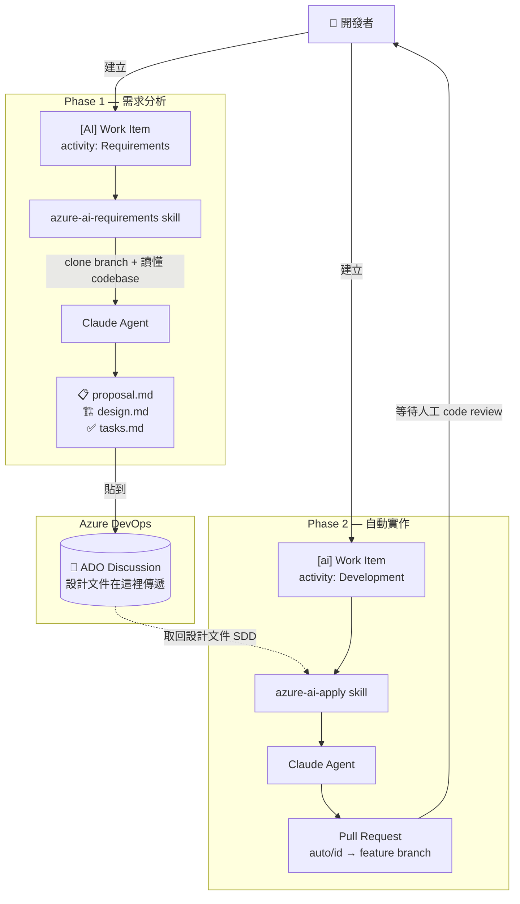
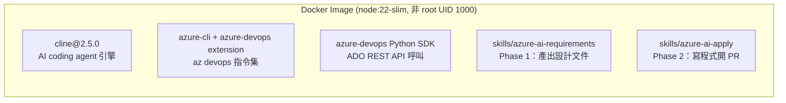
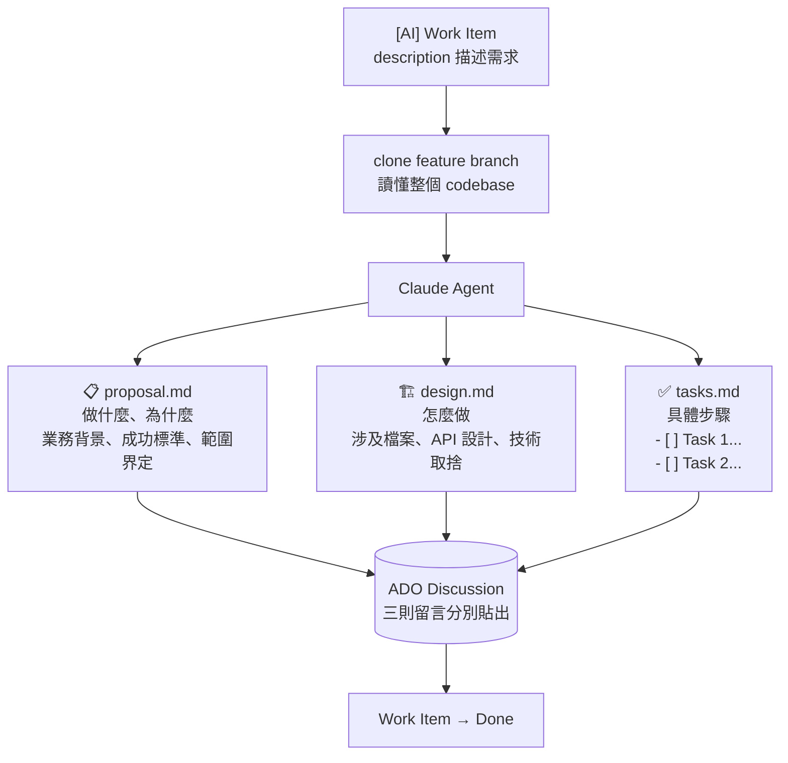
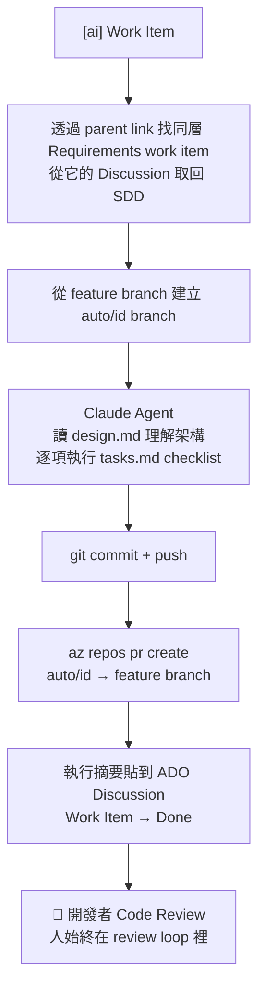

# cline-ado

> 開源 AI coding agent，整合企業 ADO 工作流，在隔離的 Docker 環境裡運行。

---

## 為什麼需要這個？

公司禁用外部 IM，CI/CD 全部在 Azure DevOps 上，開發者想用 AI 輔助寫程式 — 但市面上的 AI copilot 不是會把公司程式碼傳到雲端，就是需要 IT 不可能放行的瀏覽器擴充套件，或者根本不認識你們的 ticket 系統。

cline-ado 同時解決這三個問題。

---

## 這是什麼

一個 Docker image，把 [Cline](https://github.com/cline/cline)（生產級、開源的 AI coding agent）和完整的 Azure DevOps 工具鏈打包在一起，再透過 **skills 系統**把兩者串起來，讓 AI 能直接操作 ADO。

最終效果：AI agent 讀你的 work item、理解你的 codebase、寫程式、開 PR、關掉 ticket。全程不出公司邊界。

---

## 架構 Architecture

兩個 skill 覆蓋完整的 SDLC，透過 **ADO Discussion 作為傳遞設計文件的橋樑**。



**Container image 內容：**



---

## SDLC 自動化流程

### Phase 1 — 需求分析（`azure-ai-requirements`）

**觸發條件**：ADO work item 標題含 `[AI]`、activity = **Requirements**、已連結 branch。



### Phase 2 — 自動實作（`azure-ai-apply`）

**觸發條件**：ADO work item 標題含 `[ai]`、activity = **Development**、已連結 branch。



---

## Skills 系統

Skill 就是一個 `SKILL.md` 指令檔，加上幾支輕量 Python 腳本（處理 ADO API 呼叫）。Claude 在執行 skill 時讀取這個檔案，一步一步照著走。沒有框架魔法，全是可讀的文字。

| Skill | 呼叫方式 | 做什麼 |
|-------|----------|--------|
| `azure-ai-requirements` | `"跑 requirements"` / `"需求分析"` / `"run requirements"` | 讀需求 → 產出 SDD → 貼到 ADO |
| `azure-ai-apply` | `"跑 auto"` / `"ai task"` / `"run auto"` | 讀 SDD → 寫程式 → 開 PR → 關 ticket |

```
.claude/skills/
├── azure-ai-requirements/
│   ├── SKILL.md                 ← Claude 讀這個
│   └── scripts/
│       ├── find_work_item.py    ← 查詢符合條件的 [AI] work item
│       └── post_artifacts.py    ← 把 proposal/design/tasks 貼到 Discussion
│
└── azure-ai-apply/
    ├── SKILL.md
    └── scripts/
        ├── find_work_item.py    ← 查詢符合條件的 [ai] work item
        ├── fetch_sdd.py         ← 從 Requirements 兄弟節點取回 SDD
        └── complete_task.py     ← 貼 PR 連結、更新 work item 狀態
```

---

## 快速開始 Quick Start

### 1. 取得 image

```bash
docker pull your-org/cline-ado:latest
```

### 2. 建立 ADO Personal Access Token（PAT）

前往 `https://dev.azure.com/<your-org>/_usersSettings/tokens`

需要的 scope：**Code** (Read, Write) · **Work Items** (Read, Write) · **Pull Requests** (Read, Write)

### 3. 設定環境變數

```bash
cp .env.example .env
# 填入 OPENAI_API_KEY、ADO_ORG、ADO_PAT、ADO_PROJECT
```

### 4. 啟動

```bash
# 互動模式（TUI 介面）
docker compose run --rm cline

# Headless：執行需求分析 skill
docker compose run --rm cline -y "run azure-ai-requirements"

# Headless：執行自動實作 skill
docker compose run --rm cline -y "run azure-ai-apply"
```

---

## 環境變數 Environment Variables

### AI Provider

| 變數 | 必填 | 說明 |
|------|------|------|
| `OPENAI_API_KEY` | ✅ | API key，支援 OpenAI、Azure OpenAI，以及任何相容的 endpoint |
| `OPENAI_BASE_URL` | — | 自訂 endpoint，用於 Azure OpenAI、Ollama、vLLM、LM Studio 等 |
| `CLINE_MODEL` | — | 覆寫預設模型（預設：`gpt-4o`） |

**常見 provider 設定範例：**

```bash
# Azure OpenAI
OPENAI_BASE_URL=https://<resource>.openai.azure.com/openai/deployments/<deployment>

# Ollama（本機，從 container 連 host）
OPENAI_BASE_URL=http://host.docker.internal:11434/v1
CLINE_MODEL=llama3.2

# vLLM / 其他 self-hosted
OPENAI_BASE_URL=http://your-server:8000/v1
```

### Azure DevOps

| 變數 | 必填 | 說明 |
|------|------|------|
| `ADO_PAT` | ✅ | Personal Access Token |
| `ADO_ORG` | ✅ | 組織名稱（`dev.azure.com/` 後面那段） |
| `ADO_PROJECT` | — | 預設專案名稱 |

### 企業 Proxy

| 變數 | 說明 |
|------|------|
| `HTTPS_PROXY` | Proxy URL，例如 `http://proxy.corp.com:8080` |
| `NO_PROXY` | 不走 proxy 的 hostname，逗號分隔，例如 `localhost,.corp.internal` |

---

## 目錄結構 File Structure

```
clinewithADO/
├── Dockerfile              # node:22-slim，裝好 Azure CLI + Cline，非 root 執行
├── entrypoint.sh           # 設定 AI provider + az devops 認證，然後 exec cline
├── docker-compose.yml      # 掛載 ./workspace，保留 cline-data volume
├── .env.example            # 所有環境變數說明
├── Makefile                # build / push / run / test / shell 快捷指令
├── .dockerignore
└── .claude/
    └── skills/
        ├── azure-ai-requirements/   # Phase 1 skill
        └── azure-ai-apply/          # Phase 2 skill
```

---

## 安全性 Security

| 問題 | 對策 |
|------|------|
| Supply-chain | 固定使用 `cline@2.5.0` — v2.3.0 是遭入侵的惡意版本（2026-02-17 已下架）；≥ 2.4.0 版本有 OIDC provenance 驗證 |
| 權限 | 以 `node` 使用者（UID 1000）執行，不是 root |
| 機密 | `.env` 已透過 `.dockerignore` 排除在 image 外 |
| 網路 | 無遙測、無雲端同步，流量只到你的 AI provider 和 ADO |
| Code review | Skills 只開 PR，不直接 merge，開發者完整保留審查權 |

---

## 未來規劃 Roadmap

**ACP browser 整合**
透過 Agent Communication Protocol 讓 agent 能往外連到瀏覽器，做網頁研究、查文件，不需要人工複製貼上。

**Skills 打包成 npm 套件**
把 skill 獨立版本化，像裝任何 npm 套件一樣簡單 — `npm install @your-org/skill-azure-ado`，統一管理、統一升版。

**Skill evals（效能評估機制）**
針對每個 skill 建立固定的測試案例，自動量測輸出品質，讓 skill 的迭代有客觀的回歸基準，而不只是靠感覺。

---

## 設計理念 Philosophy

企業 AI 工具通常在三個地方壞掉：它需要 IT 不會批准的雲端帳號、它不認識團隊實際用的專案管理系統，或者它給了 AI 太多不受監督的自主權。

cline-ado 建立在三個不同的選擇上：

**開源引擎。** Cline 是開源的。在你環境裡跑的 agent，每一行程式碼都可以被審計。

**OS 層級隔離。** 用 Docker container，不是用權限清單。AI 能造成的最大影響範圍被 container 邊界限死。

**ADO 作為介面。** 你的 work item、你的 branch、你的 PR。AI 在你團隊已有的工作流裡運作，而不是另起一套。

Skills 是自動化的基本單位。它們是 markdown 檔案。你的團隊任何人都可以讀懂、修改，在執行前就知道 Claude 會做什麼。

**小到可以完全理解。緊到可以放心信任。**

---

| Package | 版本 |
|---------|------|
| `cline` | 2.5.0 |
| `azure-cli` + `azure-devops` extension | 最新穩定版 |
| `azure-devops` Python SDK | 最新穩定版 |
| Node.js | 22 (slim) |
