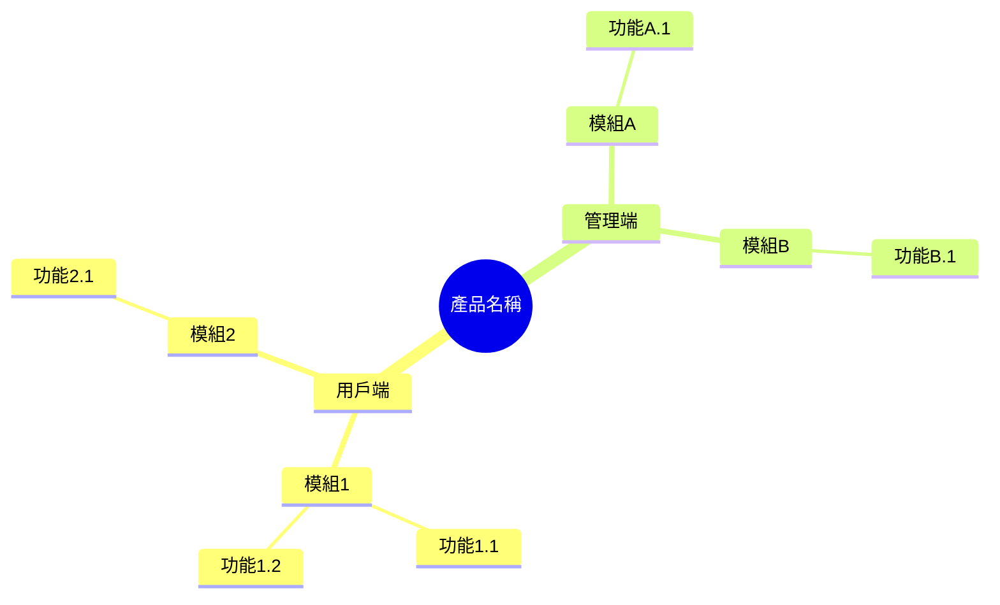
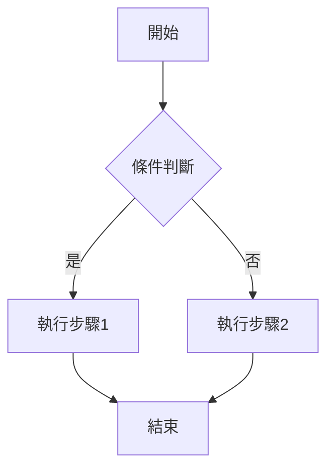

# [項目名稱] 產品需求文件 (PRD)

## 1. 文件資訊

| 欄位 | 內容 |
|-----|------|
| 產品名稱 | [產品名稱] |
| 文件版本 | V1.0 |
| 編寫日期 | [YYYY-MM-DD] |
| 編寫人 | [編寫人] |
| 最後更新 | [YYYY-MM-DD] |

## 2. 項目背景

### 2.1 業務目標

[描述產品要解決的業務問題和預期目標]

### 2.2 目標用戶

| 用戶類型 | 用戶画像 | 核心訴求 |
|---------|---------|---------|
| [用戶類型1] | [年齡/職業/特徵] | [核心需求] |
| [用戶類型2] | [年齡/職業/特徵] | [核心需求] |

### 2.3 核心價值主張

[總結該產品解決的核心問題，用一句話概括產品價值]

## 3. 產品架構

### 3.1 功能架構圖

### 3.2 用戶角色定義

| 角色名稱 | 角色描述 | 主要權限 |
|---------|---------|---------|
| 普通用戶 | [描述] | [權限列表] |
| 管理員 | [描述] | [權限列表] |

## 4. 核心業務流程

## 5. 詳細功能說明

### 5.1 模組名稱

#### 5.1.1 功能名稱

| 欄位 | 說明 |
|-----|------|
| **功能編號** | [F-01] |
| **功能描述** | [用戶可以做什麼，達成什麼目的] |
| **前置條件** | [使用該功能前需滿足的條件] |
| **優先級** | P0/P1/P2 |

**頁面元素**：

| 元素 | 類型 | 說明 | 校驗規則 |
|-----|------|-----|---------|
| [元素名] | 輸入框/按鈕/下拉 | [說明] | [校驗規則] |

**互動邏輯**：

1. 用戶點擊[xxx]
2. 系統顯示[xxx]
3. 用戶輸入[xxx]
4. 系統執行[xxx]

**異常處理**：

| 異常場景 | 處理方式 |
|---------|---------|
| [場景1] | [提示/跳轉/重試] |
| [場景2] | [提示/跳轉/重試] |

---

## 6. 非功能需求

### 6.1 效能要求

| 指標 | 要求 |
|-----|------|
| 介面回應時間 | ≤ 200ms |
| 頁面載入時間 | ≤ 3s |
| 並發用戶數 | ≥ 1000 |

### 6.2 安全要求

- [ ] 敏感資料加密儲存
- [ ] 介面權限校驗
- [ ] 防SQL注入/XSS攻擊
- [ ] 操作日誌記錄

### 6.3 兼容性要求

| 維度 | 支援範圍 |
|-----|---------|
| 瀏覽器 | Chrome 80+, Safari 13+, Edge 80+ |
| 裝置 | PC, Tablet, Mobile |
| 解析度 | 1920×1080, 1366×768, 375×667 |

## 7. 疊代規劃

| 版本 | 包含功能 | 預計上線時間 |
|-----|---------|-------------|
| MVP | [核心功能列表] | [YYYY-MM-DD] |
| V1.1 | [增強功能列表] | [YYYY-MM-DD] |
| V2.0 | [完整功能列表] | [YYYY-MM-DD] |

## 8. 附錄

### 8.1 術語表

| 術語 | 解釋 |
|-----|------|
| [術語1] | [解釋] |

### 8.2 參考文件

- [相關文件連結]

---

*文件結束*