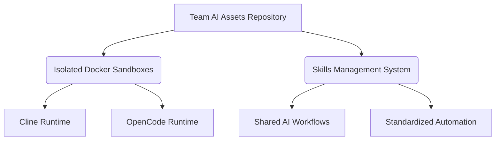
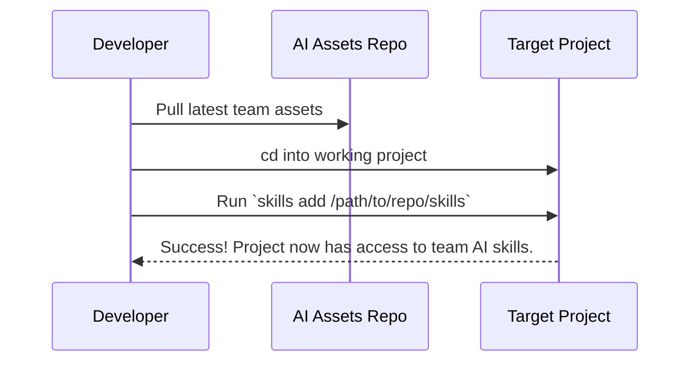

# 🚀 Enterprise AI Coding Ecosystem

> **Your team's centralized repository for AI coding assets, isolated sandboxes, and shared knowledge.**

---

## 🎯 Vision & Purpose

This repository is designed to be the foundational **AI Asset Hub** for the entire development team. 

- **Centralized Knowledge Base**
  - Consolidates all AI prompts, workflows, and configurations into a single source of truth.
  - Prevents "siloed" knowledge and ensures every team member benefits from shared discoveries.
- **Fast & Reproducible Validation**
  - Features pre-configured Docker sandboxes for immediate, safe testing of AI-generated code.
  - Allows developers to jumpstart AI tasks without spending hours debugging environment setups.
- **Polyglot Ready environments**
  - Pre-installed with NodeJS, Python 3 (with `venv`), Java 17 (JDK), and Maven.
  - Capable of building, testing, and running full-stack applications instantly.

---

## 🐳 Dual Docker Sandboxes

We support two of the most powerful Terminal AI agents. Both environments are completely isolated and ready to go.

### 1. Cline Engine
- Powered by the `cline` NPM engine.
- Best suited for deep analysis, architecture design, and automated multi-step task execution.
- Integrates seamlessly with Azure DevOps.

### 2. OpenCode Engine
- Powered by the `oh-my-opencode` CLI.
- Heavily focuses on a beautiful, interactive Terminal User Interface (TUI).
- Excellent for fast, conversational coding sessions directly in the terminal.

### ⚡ Getting Started

- **Step 1: Configure Credentials**
  - Copy `.env.example` to `.env`.
  - Add your `OPENAI_API_KEY` and (optionally) `ADO_PAT`.
- **Step 2A: Launch Cline**
  - Interactive: `docker compose -f Docker/cline/docker-compose.yml run --rm cline`
  - Automated: `docker compose -f Docker/cline/docker-compose.yml run --rm cline -y "Review the codebase"`
- **Step 2B: Launch OpenCode**
  - Interactive: `docker compose -f Docker/opencode/docker-compose.yml run --rm opencode`
  - Automated: `docker compose -f Docker/opencode/docker-compose.yml run --rm opencode run "Fix all tests"`

---

## 🧠 Skills Management

We standardise AI instructions using the powerful [skills.sh](https://skills.sh) framework. This guarantees the AI behaves consistently for everyone.

- **Offline-Ready Packaging**
  - The CLI is vendored internally at `tools/skills-1.4.4.tgz`.
  - This guarantees that even internal environments with strict firewalls can utilize the toolkit.
- **Sharable Capabilities**
  - Team members can write new modular "Skills" (e.g., specific testing standards or architectural rules).
  - Once committed here, any team member can apply the skill to their own local projects.
- **Easy Injection**
  - Navigate to your target project folder.
  - Run the `skills add` command to inject team intelligence instantly.

---

## 🌟 Essential Benefits

- **Zero Host Pollution**
  - The AI cannot accidentally delete your personal files or mess up your global configurations.
  - All side-effects are contained entirely within the ephemeral Docker container.
- **Enterprise-Grade Security**
  - Uses a non-root user (`node` UID 1000) inside the containers.
  - Follows strict `.dockerignore` rules to avoid accidentally baking secrets into images.
- **Continuous Team Evolution**
  - As the team discovers better prompts or smoother AI interaction patterns, they are merged here.
  - Upgrading the team's collective AI IQ becomes as simple as a `git pull`.
