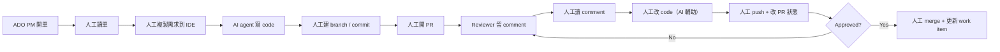
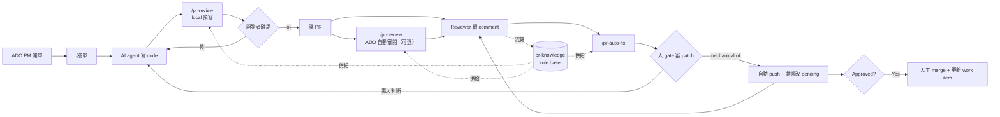

# ADO + 本地 AI Agent 半自動化開發流程 — 架構提案

> 文件目的：提供團隊評估「以本地 LLM + 自定義 Skill 自動化 ADO 開發流程」的決策依據。

---

## 1. 背景與限制

- 公司現行開發流程：ADO PM 開單 → 地端 VSCode 開發 → 人工 PR → 人工 resolve review → 人工更新工單
- **合規限制**：LLM 必須在 local 執行，不可使用 ADO Copilot 等雲端服務
- **現有資產**：Cline / Claude Code + 已自建 `ado-devops` skill（涵蓋 work item、repo、PR 的原子操作）
- **設計哲學**：半自動 + human-in-the-loop，每個階段保留人的判斷與審閱

---

## 2. 現行流程

---

## 3. 現行流程痛點

| # | 痛點 | 衝擊 |
|---|---|---|
| P1 | ADO ↔ IDE 頻繁 context switch，需求靠人工複製貼上 | 時間成本、易漏細節 |
| P2 | AI agent 不知道團隊過去的 review 慣例 | 同樣的錯重複犯、產出常踩 reviewer 地雷 |
| P3 | Review comment 循環靠人工：讀 → 改 → push | 每個 comment 都是 context switch，循環時間長 |
| P4 | 團隊 PR 知識散落於個別 PR，無法累積 | 一年下來相同的 review comment 留 10 次以上 |
| P5 | Work item 狀態仰賴開發者記得更新 | PM / Scrum master 拿到失真資訊 |
| P6 | 新人 onboarding 完全靠 mentor 口傳 | 學習曲線陡、知識流失 |

---

## 4. 新架構提案

在既有 `ado-devops` 原子操作之上，新增 4 個 skill，組合成 workflow：

| Skill | 階段 | 輸入 | 輸出 |
|---|---|---|---|
| `接單` | 需求 → Dev | work item ID | 可餵給 AI agent 的 context 包（需求、AC、關聯 wiki / PR） |
| `pr-knowledge` | 跨階段 | 過去 PR review comments | 團隊 review rule base |
| `pr-review` | PR 送審前 / 送審後 | local diff 或 ADO PR + pr-knowledge | 預審建議（local 模式）/ 自動審閱意見（ADO 模式） |
| `pr-auto-fix` | PR 送審後 | ADO PR active comments | AI patch → 人 gate → 自動 push + 改狀態為 pending |

### 4.1 流程圖

### 4.2 Human Gate 配置

| Skill | 自動做什麼 | 人介入什麼 |
|---|---|---|
| 接單 | 打包 context、建 branch | 選要接的 work item |
| pr-review (local) | 根據 rule 列出違規與建議 | 決定採納哪些建議 |
| pr-review (ADO) | 產出審閱意見 | 決定是否貼到 PR |
| pr-auto-fix | 針對 comment 產生 patch | push 前審 patch、決定是否 pending |

---

## 5. 新舊架構對比

| 面向 | 現行架構 | 新架構 |
|---|---|---|
| 需求進入開發 | 人工複製貼上 | `/接單` 自動打包 context |
| 團隊 review 經驗 | 散落個別 PR、個人腦內 | `pr-knowledge` rule base，顯性化 |
| Pre-review | 無，直接丟給 reviewer | local 預審先接住低階錯誤 |
| Comment 循環 | 人讀 / 人改 / 人推 | AI 改（人 gate）+ 自動推 |
| 本地 LLM 依賴 | 無（無法用雲 Copilot） | 原生支援（不依賴雲端服務）|
| 合規 | 合規 | 合規 |
| 知識累積 | 流失 | 沉澱於 pr-knowledge |
| 新人 onboarding | 靠 mentor | 可讀 pr-knowledge rule 自學 |
| 人介入次數 | 7+（每步都要人） | 3（選單、過預審、過 auto-fix gate）|

---

## 6. 預期效益

1. **開發起手速度**：省掉 ADO → IDE 手動搬需求，「從讀單到開始寫」的時間壓縮
2. **Review 往返縮短**：local pre-review 接住機械性錯誤，reviewer 只看邏輯 / 設計層
3. **團隊知識資產化**：pr-knowledge 把隱性經驗變成顯性 rule，新人也能受益
4. **合規無妥協**：全流程 local LLM，不需要等公司核可任何雲端 Copilot
5. **Pipeline 標準化**：取代個人 workflow 習慣，新人上手快

---

## 7. 風險與 Open Questions

| 風險 | 緩解 |
|---|---|
| 本地 LLM 能力不足，大型 refactor 做不來 | 小任務優先、大任務仍由人主導；需要選型評估（Qwen2.5-Coder / DeepSeek-Coder / Codestral）|
| pr-knowledge rule 過時或互相矛盾 | 加 `last_validated` / approver 欄位，遇到再清理，不前置過度設計 |
| pr-auto-fix 誤解 comment 意圖 | 人 gate 必經、不自動 push；未來可加 comment 分類（mechanical vs. judgment）|
| 團隊 adoption 不如預期 | 從接單 skill 先推（風險最低、立即有感），再逐步擴散 |
| Skill 維護成本 | 集中維護於共用 repo，版本化發布 |

---

## 8. 評估指標建議

上線後建議追蹤：

- **開發起手時間**：從 work item assigned 到第一個 commit 的時間
- **PR 循環數**：reviewer 留 comment 到 PR approved 的 round 數
- **Review comment 類型分布**：mechanical / judgment 比例變化
- **Skill 使用率**：每個 skill 的週調用次數
- **pr-knowledge rule 命中率**：pr-review 建議被採納 vs. 被忽略的比例

---

## 9. 建議落地順序

1. **Phase 1 — `接單`**：低風險、立即有感，最快驗證價值
2. **Phase 2 — `pr-knowledge` 初版抽取**：需要資料累積，與 Phase 1 可並行
3. **Phase 3 — `pr-review`**：等 pr-knowledge 有一定 rule 量後啟動
4. **Phase 4 — `pr-auto-fix`**：風險最高、放最後；前三個 skill 穩定後再做

每階段獨立評估，可隨時煞車或調整方向。
