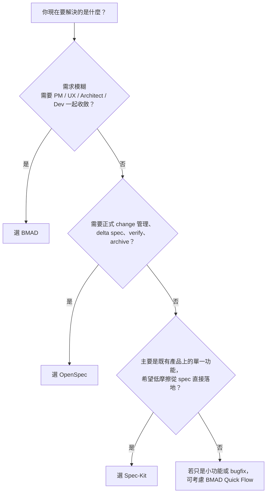
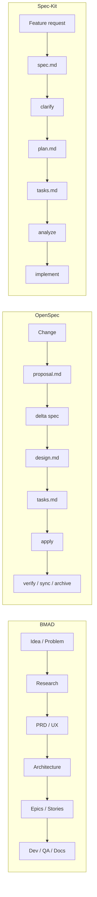
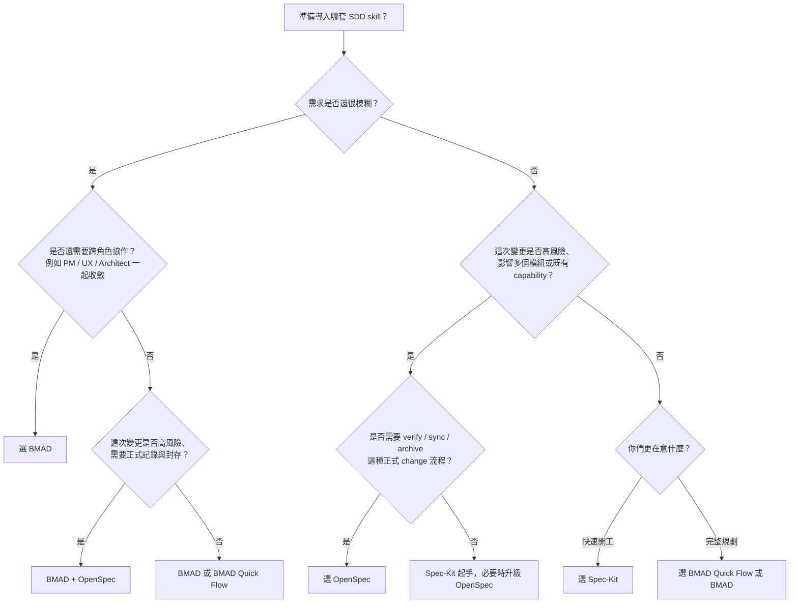

# 三套 SDD Skill 比較：BMAD、OpenSpec、Spec-Kit

> 本文依目前 repo 內的 skill 文件整理，目的是幫團隊快速理解三套 SDD 方法的設計中心、適用情境與取捨。它們都能支援 spec-driven/spec-first 工作方式，但解決的問題層級其實不同。

## 先說結論

- **BMAD** 最像「AI 產品研發團隊作業系統」：從研究、PRD、UX、架構、Epic/Story、開發、QA、文件一路串起來。
- **OpenSpec** 最像「規格管理流程」：以一個 change 為中心，明確區分 `proposal / specs / design / tasks / verify / sync / archive`。
- **Spec-Kit** 最像「輕量 SDD 生產線」：以 feature branch 為中心，快速跑完 `spec -> clarify -> plan -> tasks -> analyze -> implement`。

一句話判斷：

- 需求還很模糊、需要多角色協作：先看 **BMAD**
- 需要 change audit trail、封存、規格回寫主規格：先看 **OpenSpec**
- 想讓工程團隊低摩擦地把功能規格化並直接落地：先看 **Spec-Kit**

## 這三套其實不是同一層級的工具

最容易混淆的地方是：它們都會產生規格文件，但「核心單位」不同。

| 系統 | 核心單位 | 主要在解什麼問題 |
|---|---|---|
| **BMAD** | Agent + Workflow + Story | 多角色協作與完整產品開發流程 |
| **OpenSpec** | Change | 變更規格管理、規格差異管理、封存與驗證 |
| **Spec-Kit** | Feature Branch | 單一功能的快速規格化、規劃與實作 |

所以，BMAD 比較像「方法論 + 角色分工」，OpenSpec 比較像「規格管理框架」，Spec-Kit 比較像「日常 feature delivery pipeline」。

這裡要特別注意一點：**OpenSpec 和 Spec-Kit 的「完整」不是同一種完整。**

- **OpenSpec** 比較完整的是「change lifecycle」：這次變更怎麼提出、驗證、同步、封存
- **Spec-Kit** 比較完整的是「feature planning package」：這個功能怎麼寫清楚、拆細、規劃、實作

## 一張圖先選工具



## 核心差異總覽

| 面向 | BMAD | OpenSpec | Spec-Kit |
|---|---|---|---|
| 啟動方式 | `/bmad` 後選 Agent/Workflow | `/opsx-*` 指令族 | 由 agent 依描述自動匹配 skill，也可直接點名 skill |
| 組織形式 | 1 個 skill 內含 9 位 agent | 一組 slash-command skills | 一組細分的專用 skills |
| 主流程 | 研究 -> PRD -> UX/架構 -> Epics/Stories -> Dev/QA/Docs | proposal -> delta specs -> design -> tasks -> apply -> verify -> sync -> archive | spec -> clarify -> plan -> tasks -> analyze -> implement |
| 輸出重心 | 規劃文件與 story-ready 實作上下文 | 變更文件、主規格同步與封存 | 單一功能的規格、計畫與任務 |
| 完整性強項 | 產品到開發的完整協作流 | 變更生命週期完整 | 功能規劃文件包完整 |
| 主要檔案位置 | `docs/planning/`、`docs/stories/` | `openspec/changes/`、`openspec/specs/` | `specs/{branch}/`、`.specify/` |
| 規格管理強度 | 中高 | 高 | 中 |
| 導入摩擦 | 中高 | 中 | 低到中 |
| 對非工程角色友善 | 高 | 中 | 中低 |
| 最適合的節奏 | 新專案、跨角色討論、需求探索 | 高風險變更、跨團隊協作、需審計軌跡 | 日常 feature delivery、MVP、既有產品迭代 |

## 三套流程長什麼樣



## 產出物與目錄差異

### BMAD

BMAD 的輸出物最完整，目標是讓整個團隊從「想法」一路走到「可開發的 story」。

典型輸出：

- `docs/planning/prd.md`
- `docs/planning/architecture.md`
- `docs/planning/epics.md`
- `docs/stories/sprint-status.yaml`
- `docs/stories/1-1-user-auth.md`

特色：

- 以文件層次支援 PM、架構師、Scrum Master、Developer、QA、Technical Writer
- 有 **Quick Flow** 可快速跳過完整流程
- 有 **Party Mode** 可讓多 agent 共同評估同一議題

### OpenSpec

OpenSpec 的重點不是「文件份數最多」，也不是「把整個產品流程做完」，而是把每個 change 的生命週期管得很清楚。

典型輸出：

- `openspec/changes/<name>/proposal.md`
- `openspec/changes/<name>/specs/<capability>/spec.md`
- `openspec/changes/<name>/design.md`
- `openspec/changes/<name>/tasks.md`
- `openspec/specs/<capability>/spec.md`
- `openspec/changes/archive/YYYY-MM-DD-<name>/`

特色：

- 有 **delta spec** 與主規格同步概念
- 有 **verify**、**status**、**archive**，規格管理能力最完整
- change 可以一次產生，也可以分步生成
- 比起單純的 feature 文件包，它更像「有狀態的正式變更單」

### Spec-Kit

Spec-Kit 比較貼近工程師的日常節奏：一個 branch，一個 feature folder，一路從 spec 推到 implement。

典型輸出：

- `specs/{branch}/spec.md`
- `specs/{branch}/plan.md`
- `specs/{branch}/research.md`
- `specs/{branch}/data-model.md`
- `specs/{branch}/contracts/`
- `specs/{branch}/tasks.md`
- `.specify/memory/constitution.md`

特色：

- 以 feature branch 為工作單位
- 有 `clarify` 與 `analyze`，先降低歧義再進實作
- 可用 `.specify/extensions.yml` 加 extension hooks
- 比起正式 change 管理，它更像「工程團隊可直接開工的功能實作包」

## 一頁對照表

| 問題 | BMAD | OpenSpec | Spec-Kit |
|---|---|---|---|
| **它最像什麼** | AI 產品研發團隊作業系統 | 有狀態的正式變更單 | 工程團隊可直接開工的功能實作包 |
| **核心工作單位** | Agent / Workflow / Story | Change | Feature branch |
| **主要目的** | 把模糊需求一路收斂到可開發 | 把一次變更正式記錄、驗證、同步、封存 | 把單一功能寫清楚、拆細、規劃後直接實作 |
| **最強的完整性** | 產品到開發的跨角色協作流程 | Change lifecycle 完整 | Feature planning package 完整 |
| **典型輸出** | `prd.md`、`architecture.md`、`epics.md`、story files | `proposal.md`、delta specs、`design.md`、`tasks.md` | `spec.md`、`plan.md`、`research.md`、`data-model.md`、`tasks.md` |
| **進度怎麼看** | 看 sprint/story 狀態與 agent workflow 產物 | 看 `status / verify / archive` 與 change 狀態 | 看 feature 資料夾是否齊全、`tasks.md` checkbox、checklist、`analyze` 結果 |
| **如何知道少文件** | 由 workflow 順序與產物判斷 | 由 change artifact 狀態直接判斷 | 每一步檢查前置檔案，例如沒 `plan.md` 或 `tasks.md` 就停 |
| **誰最容易用得上** | PM、Architect、Scrum Master、Developer、QA | Tech lead、架構師、需要審核與封存的團隊 | 工程團隊、feature owner、日常迭代開發者 |
| **最適合的場景** | 新產品、跨角色需求探索、大型功能 | 高風險變更、跨團隊協作、需要 audit trail | 既有產品上的單一功能、MVP、快速迭代 |
| **不太適合** | 小 bug、單純增量需求 | 純探索期、小改動且不想維護主規格 | 需要正式 archive/sync 的 change 管理 |
| **一句話選擇** | 需求還模糊，就用 BMAD | 要正式追蹤這次變更，就用 OpenSpec | 要把功能快速 spec 化並開工，就用 Spec-Kit |

## 團隊導入建議矩陣

這張表不是在比「哪套比較好」，而是在比「你們現在最需要哪種能力」。

| 需求模糊度 | 變更風險 / 影響範圍 | 正式記錄 / 可稽核需求 | 建議主工具 | 原因 |
|---|---|---|---|---|
| 高 | 高 | 高 | **BMAD + OpenSpec** | 先用 BMAD 收斂需求與架構，再用 OpenSpec 把 change 正式記錄、驗證、封存 |
| 高 | 中 | 中 | **BMAD** | 問題還沒收斂，先把 PRD、架構、story-ready 文件補齊最重要 |
| 中 | 高 | 高 | **OpenSpec** | 功能方向大致清楚，但變更風險高，需要正式追蹤與主規格同步 |
| 中 | 中 | 中 | **Spec-Kit** 或 **OpenSpec** | 若偏日常交付選 Spec-Kit；若偏跨團隊控管選 OpenSpec |
| 低 | 高 | 高 | **OpenSpec** | 需求已清楚，不需要太多探索，但需要正式變更紀錄 |
| 低 | 中 | 低 | **Spec-Kit** | 最適合工程團隊快速把功能 spec 化、拆任務、直接開工 |
| 低 | 低 | 低 | **Spec-Kit** 或 **BMAD Quick Flow** | 小功能、bugfix、重構，以低摩擦落地為主 |

### 三個判斷軸怎麼看

| 判斷軸 | 高代表什麼 | 低代表什麼 |
|---|---|---|
| **需求模糊度** | 還需要研究、澄清、UX/架構討論 | 需求已清楚，幾乎可以直接拆任務 |
| **變更風險 / 影響範圍** | 影響多個模組、既有 capability、跨團隊協作 | 單點功能、局部修改、容易回滾 |
| **正式記錄 / 可稽核需求** | 需要驗證、同步、封存、長期查詢 | 只要文件能支援這次開發即可 |

### 最常見的三種導入路線

1. **工程團隊先落地**
   從 **Spec-Kit** 開始。最容易上手，也最接近日常 feature 開發。

2. **高風險變更先落地**
   從 **OpenSpec** 開始。先建立正式變更記錄、驗證與封存習慣。

3. **新產品或大功能規劃先落地**
   從 **BMAD** 開始。先把需求探索、PRD、架構與 stories 建完整。

### 混搭建議

- **BMAD -> Spec-Kit**
  適合先做需求探索，再交給工程團隊用較輕量的方式落地。

- **BMAD -> OpenSpec**
  適合大型或高風險功能：前段用 BMAD 收斂，後段用 OpenSpec 正式管理變更。

- **Spec-Kit -> OpenSpec**
  適合平常用 Spec-Kit 跑日常功能，只有重要 change 才升級到 OpenSpec。

## 導入決策圖



## 比較圖表：五個維度的相對強弱

> 下表是依 repo 內 skill 設計做的相對評估，不是絕對分數。

| 維度 | BMAD | OpenSpec | Spec-Kit |
|---|---:|---:|---:|
| 流程完整度 | 5 | 4 | 3 |
| 變更追溯與審核 | 3 | 5 | 3 |
| 導入速度 | 3 | 4 | 5 |
| 多角色協作支援 | 5 | 3 | 2 |
| 日常 feature 交付效率 | 3 | 3 | 5 |

如果把這張表翻成一句話：

- **BMAD** 贏在「完整」
- **OpenSpec** 贏在「規格管理」
- **Spec-Kit** 贏在「速度」

## 各自最適合的場景

### 1. 什麼時候用 BMAD

適合：

- 新產品或新模組，需求還不夠清楚
- 需要市場研究、產品定義、UX、架構一起跑
- 團隊想用 AI 來模擬 PM / Architect / QA / Writer 分工
- 想先把 story-ready 文件做完整，再交給工程實作

不那麼適合：

- 只是修一個 bug
- 只是既有架構上的小功能增量
- 團隊沒有打算維護一套較完整的文件體系

### 2. 什麼時候用 OpenSpec

適合：

- 變更需要明確的「為什麼 / 改什麼 / 怎麼改 / 做哪些任務」
- 需要 `verify -> sync -> archive` 的規格管理閉環
- 變更會影響現有 capability，必須保留 delta 與主規格同步紀錄
- 跨團隊或高風險變更，需要清楚的審核與封存

不那麼適合：

- 需求探索階段
- 團隊只想快速做功能，不想維護 change lifecycle
- 沒有主規格庫要同步

### 3. 什麼時候用 Spec-Kit

適合：

- 已有穩定產品與 repo 結構
- 目標是讓工程團隊把單一功能「先寫清楚，再實作」
- 想要 branch-based 的 SDD，並保持低摩擦
- 想把歧義澄清、任務分解、文件一致性分析納入日常流程

不那麼適合：

- 需要正式 archive / change audit trail
- 需要完整的 PM / UX / 架構協作方法
- 團隊希望所有規格管理都集中在一套 change registry

## 優缺點整理

### BMAD

優點：

- 角色分工最完整，從研究到文件幾乎全覆蓋
- 很適合把模糊需求逐步收斂成可實作故事
- Quick Flow 與 Party Mode 很適合團隊討論與快速試跑

缺點：

- 流程最長，若直接拿來做日常小功能會顯得重
- 需要團隊理解 9 位 agent 與多個 workflow，學習曲線較高
- 文件輸出多，若沒有維護習慣，容易變成只寫不追

### OpenSpec

優點：

- change lifecycle 非常清楚，規格管理最完整
- delta spec 與主規格同步機制很適合中大型團隊
- `status / verify / sync / archive` 很適合做進度與品質控管

缺點：

- 對需求探索與產品研究支援較少
- 比較偏 change management，不是完整產品方法論
- 如果團隊沒有 spec repository 或正式變更紀錄的習慣，仍會覺得有流程負擔

### Spec-Kit

優點：

- 路徑最直，適合工程團隊日常使用
- branch-based 思維很容易跟既有 Git 流程對齊
- `clarify`、`tasks`、`analyze` 對降低返工很有幫助
- 工程規劃文件拆得比 OpenSpec 更細，交接給開發者時通常更直接

缺點：

- 規格管理與封存能力不如 OpenSpec
- 非工程角色的參與感不如 BMAD
- 若 feature 很大、涉及多個 capability，單 branch folder 模型可能不夠強
- 多輪迭代後，比較需要靠團隊自己維持文件一致性

## 同一個需求，三套會怎麼做

假設需求是：**「為現有登入流程新增 MFA，並補上管理員停用 MFA 的能力」**

### 用 BMAD 的做法

可能流程：

1. `/bmad`
2. 選 `PM` 跑 `CP`，先產生 `prd.md`
3. 選 `AR` 跑 `CA`，產生 `architecture.md`
4. 選 `PM` 跑 `CE`，拆成 epics/stories
5. 選 `SM` 跑 `CS`，準備 story 檔
6. 選 `DV` 跑 `DS`，進入實作

你得到的會是：

- 完整產品需求脈絡
- 架構決策與 story-ready 開發上下文
- 比較像「一個完整專案/模組的開發套件」

### 用 OpenSpec 的做法

可能流程：

```text
/opsx-propose add-mfa-login
/opsx-apply add-mfa-login
/opsx-verify add-mfa-login
/opsx-archive add-mfa-login
```

你得到的會是：

- `proposal.md`：為什麼要做 MFA
- `specs/auth/spec.md`：登入 capability 的 delta spec
- `design.md`：MFA token、驗證流程、管理員停用邏輯
- `tasks.md`：具體實作清單
- `verify / sync / archive`：做完後可驗證並回寫主規格

這很適合「需要完整追蹤、驗證、封存的正式 change」。

### 用 Spec-Kit 的做法

可能流程：

1. 對 agent 描述需求，觸發 `speckit-specify`
2. 視需要跑 `speckit-clarify`
3. 跑 `speckit-plan`
4. 跑 `speckit-tasks`
5. 跑 `speckit-analyze`
6. 跑 `speckit-implement`

你得到的會是：

- `specs/1-mfa-login/spec.md`
- `plan.md`、`research.md`、`data-model.md`
- `tasks.md`
- 一份給工程團隊直接使用的功能實作包

這很適合「在既有產品上，把單一功能快速 spec 化後落地」。

## 團隊如果只選一套，怎麼選

| 你們現在最在意的事 | 建議先試哪套 |
|---|---|
| 想把需求探索、PRD、架構、story 準備整套建立起來 | **BMAD** |
| 想把 change 管理、驗證、封存、主規格同步做好 | **OpenSpec** |
| 想讓工程團隊快速開始 SDD，不想一開始就太重 | **Spec-Kit** |

## 比較實際的導入建議

### 建議一：不要三套一起全面導入

最常見的失敗原因不是 skill 不好，而是團隊同時試太多流程，最後誰都沒真正用起來。

比較穩的方式是：

1. 先選一條主線
2. 用 1 到 2 個真實需求跑完整輪
3. 再決定是否混搭

### 建議二：可以分層混搭

一個很合理的混搭方式是：

- **BMAD** 用在需求探索、PRD、架構收斂
- **Spec-Kit** 用在日常 feature 開發
- **OpenSpec** 用在高風險或跨團隊 change 的正式規格管理

也就是說，它們不一定是替代關係，很多時候是不同階段的工具。

### 建議三：評估時看三件事

- 團隊每週大多數工作是「新產品探索」還是「既有系統迭代」？
- 你們需不需要 change archive、spec sync、verify 這種規格管理能力？
- 誰會真的維護文件？只有工程師，還是 PM / Architect / QA 也會一起用？

## 最後的判斷

如果只用一句話總結：

- **BMAD**：最完整，但也最像一套方法論
- **OpenSpec**：最嚴謹，但偏 change-based 的規格管理
- **Spec-Kit**：最輕快，最像工程團隊日常工作流

對大多數團隊來說，真正該問的不是「哪套最好」，而是：

**你們現在最缺的是完整協作、規格管理，還是低摩擦落地？**

答案不同，最佳選擇就不同。

## 參考文件

- [BMAD 手冊](../Skills/bmad-method/MANUAL.md)
- [OpenSpec README](../Skills/openspec/README.md)
- [OpenSpec `opsx-propose`](../Skills/openspec/opsx-propose/SKILL.md)
- [OpenSpec `opsx-apply`](../Skills/openspec/opsx-apply/SKILL.md)
- [OpenSpec `opsx-verify`](../Skills/openspec/opsx-verify/SKILL.md)
- [Spec-Kit 使用手冊](../Skills/spec-kit-skill/USAGE.md)
- [Spec-Kit `speckit-specify`](../Skills/spec-kit-skill/speckit-specify/SKILL.md)
- [Spec-Kit `speckit-plan`](../Skills/spec-kit-skill/speckit-plan/SKILL.md)
- [Spec-Kit `speckit-tasks`](../Skills/spec-kit-skill/speckit-tasks/SKILL.md)
- [Spec-Kit `speckit-implement`](../Skills/spec-kit-skill/speckit-implement/SKILL.md)
